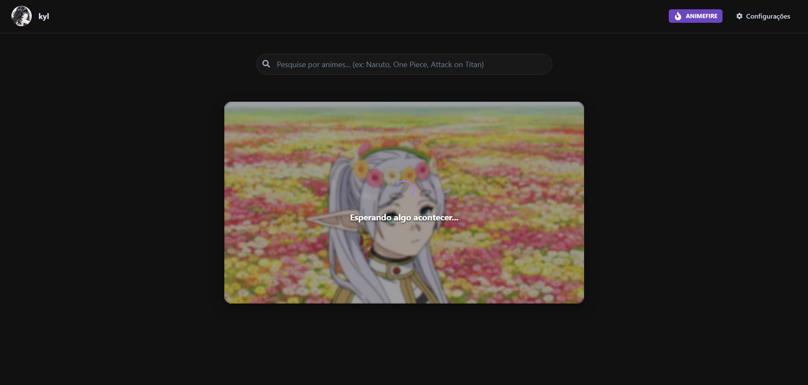

# 🌙 Waluna

[WARNING]
ESSE PROJETO ESTÁ ATUALMENTE EM UMA REFATORAÇÃO COMPLETA E MUDANÇA DE TECNOLOGIAS, CASO QUEIRA UTILIZAR A ULTIMA VERSÃO FUNCIONAL, VEJA A BRANCH [LEGACY]([LEGACY](https://github.com/kyl8/waluna/tree/legacy)).

THIS PROJECT IS CURRENTLY UNDERGOING A COMPLETE REFACTORING AND TECH CHANGE. IF YOU WISH TO USE THE LATEST FUNCTIONAL VERSION, PLEASE SEE [LEGACY]([LEGACY](https://github.com/kyl8/waluna/tree/legacy)) BRANCH.
Waluna é uma plataforma de streaming de vídeos construída com **Rust** (backend) e **JavaScript** (frontend). Oferece streaming via torrent com conversão HLS em tempo real e legendas (ou via fontes externas), permitindo reprodução enquanto o arquivo está sendo baixado.

Waluna is a video streaming platform built with **Rust** (backend) and **ReactJS** (frontend). It offers torrent streaming with real-time HLS conversion and subtitles (or via external sources), allowing playback while the file is being downloaded.

## Documentação / Documentation

Para documentação detalhada, consulte (está em inglês) [DOCS.md](docs/DOCS.md)

For detailed documentation, see [DOCS.md](docs/DOCS.md).

## Fotos / Screens

<!--  -->

